# Project Nova - Complete Three-Model System Flowchart

This document contains comprehensive flowcharts showing the architecture, workflow, and data flow of the Project Nova equitable credit scoring system. **Project Nova implements three distinct modeling approaches** to demonstrate comprehensive fairness strategies: Baseline (no mitigation), Equalized Odds (post-processing), and Reweighing (pre-processing).

## 1. High-Level System Architecture

## 2. Complete Workflow Process

```mermaid
---
id: 4ac88606-7c13-4110-8055-19c74b71d52c
---
flowchart TD
    START([🚀 Start Project Nova]) --> CHOICE{Choose Execution Path}
    
    %% Manual Path
    CHOICE -->|Manual Steps| MANUAL["`🔧 **Manual Execution**
    Run individual components`"]
    
    %% Automated Path
    CHOICE -->|Automated Pipeline| AUTO["`⚡ **Automated Pipeline**
    run_project.py`"]
    
    %% Batch Data Generation Path
    CHOICE -->|Batch Data Generation| BATCH["`📦 **Batch Generation**
    generate_datasets.ps1`"]
    
    subgraph "📦 Batch Data Generation Workflow"
        BATCH --> BATCH_CHOICE{Select Dataset Type}
        BATCH_CHOICE -->|Development| DEV_DATA["`🔧 **Dev Datasets**
        - dev_tiny.csv (1K)
        - dev_small.csv (5K)
        - dev_medium.csv (15K)`"]
        
        BATCH_CHOICE -->|Testing| TEST_DATA["`🧪 **Test Datasets**
        - test_partners.csv (25K)
        - test_partners_alt.csv (25K)
        - holdout_test.csv (10K)`"]
        
        BATCH_CHOICE -->|Production| PROD_DATA["`🏭 **Production Datasets**
        - prod_baseline.csv (50K)
        - prod_large.csv (100K)
        - validation_set.csv (30K)`"]
        
        BATCH_CHOICE -->|Scenarios| SCENARIO_DATA["`🎭 **Scenario Datasets**
        - Training/Val/Test splits
        - A/B test groups
        - Fairness analysis sets
        - Time series data`"]
        
        DEV_DATA --> BATCH_COMPLETE[📁 Datasets Generated]
        TEST_DATA --> BATCH_COMPLETE
        PROD_DATA --> BATCH_COMPLETE
        SCENARIO_DATA --> BATCH_COMPLETE
    end
    
    subgraph "🤖 Main Pipeline Workflow"
        AUTO --> STEP1["`📊 **Step 1: Data Generation**
        python src/generate_data.py
        --n 50000 --seed 42
        --out data/partners.csv`"]
        
        STEP1 --> STEP2["`🎯 **Step 2: Baseline Model**
        python src/train_model.py
        --mitigation none
        → model_baseline.pkl
        → partners_scores_baseline.csv`"]
        
        STEP2 --> STEP3["`⚖️ **Step 3: Equalized Odds Model**
        python src/train_model.py
        --mitigation equalized_odds
        → model_fair.pkl
        → partners_scores_fair.csv
        Different decisions (0.0201 rate)`"]
        
        STEP3 --> STEP4["`⚖️ **Step 4: Reweighed Model**
        python src/train_model.py
        --mitigation reweighing
        → model_reweighed.pkl
        → partners_scores_reweighed.csv
        Different probabilities & scores`"]
        
        STEP4 --> COMPLETE["`✅ **Pipeline Complete**
        Three models trained
        Three sets of reports
        Three score files for comparison`"]
    end
    
    subgraph "🔧 Manual Workflow"
        MANUAL --> MAN_GEN["`📊 **Generate Data**
        Choose size, seed, output`"]
        MAN_GEN --> MAN_TRAIN["`🤖 **Train Models**
        Choose mitigation strategy:
        - none (baseline)
        - equalized_odds (post-processing)
        - reweighing (pre-processing)`"]
        MAN_TRAIN --> MAN_ANALYZE["`📈 **Analyze Results**
        Use Jupyter notebooks
        Compare fairness metrics
        Examine Nova score differences`"]
    end
    
    BATCH_COMPLETE --> END_SUCCESS[🎉 Success!]
    COMPLETE --> END_SUCCESS
    MAN_ANALYZE --> END_SUCCESS
    
    style START fill:#e1f5fe
    style END_SUCCESS fill:#e8f5e8
    style AUTO fill:#fff3e0
    style BATCH fill:#f3e5f5
    style MANUAL fill:#e3f2fd
```

## 3. Data Generation Deep Dive

```mermaid
---
id: 1768f21f-b6a4-4f16-ba3f-8a385c5819b0
---
flowchart TD
    INPUT_PARAMS["`🎛️ **Input Parameters**
    --n: Number of records
    --seed: Random seed
    --out: Output path`"] --> INIT_RNG[🎲 Initialize RNG]
    
    INIT_RNG --> GEN_DEMO["`👥 **Generate Demographics**
    - Role: 70% drivers, 30% merchants
    - Region: 50% metro, 35% suburban, 15% rural
    - Gender: 45% female, 50% male, 5% nonbinary
    - Age: 18-65 years
    - Tenure: 1-84 months`"]
    
    GEN_DEMO --> GEN_ECONOMIC["`💰 **Generate Economic Features**
    - Base earnings by role
    - Regional adjustments
    - Trip frequency patterns
    - Wallet transaction data`"]
    
    GEN_ECONOMIC --> GEN_PERFORMANCE["`⭐ **Generate Performance Metrics**
    - On-time rate (μ=0.93, σ=0.05)
    - Cancellation rate (μ=0.04, σ=0.03)
    - Customer rating (μ=4.7, σ=0.25)
    - Safety incidents (Poisson λ=0.05)`"]
    
    GEN_PERFORMANCE --> GEN_FINANCIAL["`🏦 **Generate Financial Behavior**
    - Income volatility
    - Seasonality patterns
    - Prior loans (18% probability)
    - Prior defaults (5% + 2% if prior loans)`"]
    
    GEN_FINANCIAL --> GEN_VEHICLE["`🚗 **Generate Vehicle Features**
    - Vehicle type (drivers only)
    - Fuel cost share
    - Vehicle-specific patterns`"]
    
    GEN_VEHICLE --> RISK_MODEL["`🎯 **Latent Risk Model**
    z = -0.002×(earnings-1000) +
        -3.0×(on_time_rate-0.7) +
        +8.0×cancel_rate +
        -1.5×(customer_rating-3.0) +
        +2.0×income_volatility +
        ... (15 total factors)`"]
    
    RISK_MODEL --> BIAS_INJECTION["`⚠️ **Controlled Bias Injection**
    Geographic bias:
    - Rural: +0.15 risk
    - Suburban: +0.05 risk
    - Metro: -0.05 risk
    Role bias: Merchants -0.05`"]
    
    BIAS_INJECTION --> PROB_CALC["`📊 **Probability Calculation**
    1. Apply sigmoid transformation
    2. Calibrate to ~8-12% default rate
    3. Generate binary outcomes`"]
    
    PROB_CALC --> OUTPUT_CSV["`💾 **Output Generation**
    partners.csv with 21 features:
    - Demographics
    - Economic indicators  
    - Performance metrics
    - Risk factors
    - Target variable (defaulted_12m)`"]
    
    OUTPUT_CSV --> METADATA["`📋 **Generate Metadata**
    metadata.json with:
    - Dataset configuration
    - Sensitive attributes
    - Generation parameters`"]
    
    style RISK_MODEL fill:#ffebee
    style BIAS_INJECTION fill:#fff8e1
    style OUTPUT_CSV fill:#e8f5e8
```

## 4. Machine Learning Pipeline Detail

```mermaid
---
id: 89ef0516-30d4-4781-af76-6578179f23a5
---
flowchart TD
    DATA_INPUT["`📊 **Input Data**
    partners.csv
    (50K records, 21 features)`"] --> LOAD_SPLIT["`📋 **Data Loading & Splitting**
    - Load CSV data
    - Extract features (X)
    - Extract target (y)
    - Extract sensitive attributes
    - Train/test split (80/20)`"]
    
    LOAD_SPLIT --> PREPROCESS["`🔧 **Preprocessing Pipeline**
    Numerical Features:
    - Median imputation
    - Standard scaling
    
    Categorical Features:
    - Mode imputation
    - One-hot encoding`"]
    
    PREPROCESS --> MODEL_CHOICE{Mitigation Strategy}
    
    MODEL_CHOICE -->|none| BASELINE["`🎯 **Baseline Model**
    HistGradientBoostingClassifier
    - max_depth=None
    - learning_rate=0.06
    - max_iter=350
    - No fairness constraints`"]
    
    MODEL_CHOICE -->|reweighing| REWEIGHT["`⚖️ **Reweighing Approach**
    Pre-processing mitigation:
    - Calculate group weights
    - Inverse propensity weighting
    - Balance positive rates`"]
    
    MODEL_CHOICE -->|equalized_odds| EQ_ODDS["`⚖️ **Equalized Odds**
    Post-processing mitigation:
    - ThresholdOptimizer
    - Equal TPR/FPR across groups
    - Fairlearn implementation`"]
    
    BASELINE --> CALIBRATION["`🎯 **Probability Calibration**
    CalibratedClassifierCV:
    - Method: Isotonic regression
    - CV: 3-fold
    - Ensures reliable probabilities`"]
    
    REWEIGHT --> CALIBRATION
    EQ_ODDS --> CALIBRATION
    
    CALIBRATION --> PREDICTION["`🔮 **Generate Predictions**
    - Probability scores
    - Binary classifications
    - Nova Score conversion
    (300 + (1-prob_default) × 550)`"]
    
    PREDICTION --> EVALUATION["`📈 **Model Evaluation**
    Performance Metrics:
    - ROC AUC
    - PR AUC  
    - Brier Score
    
    Fairness Metrics:
    - Demographic Parity
    - Equalized Odds
    - Equal Opportunity`"]
    
    EVALUATION --> SAVE_OUTPUTS["`💾 **Save Outputs**
    - models/model_*.pkl
    - reports/metrics_*.json
    - reports/fairness_*.json
    - data/partners_scores_*.csv`"]
    
    style MODEL_CHOICE fill:#e1f5fe
    style BASELINE fill:#f3e5f5
    style REWEIGHT fill:#fff3e0
    style EQ_ODDS fill:#e8f5e8
    style EVALUATION fill:#fce4ec
```

## 5. Three-Model Fairness Comparison

```mermaid
flowchart TD
    INPUT_DATA["`📊 **Input Data**
    partners.csv (50K records)
    21 features + target`"] --> SPLIT{Data Splitting}
    
    SPLIT --> TRAIN_SET["`🏅 **Training Set**
    75% of data (37,500 records)
    Stratified by target variable`"]
    
    SPLIT --> TEST_SET["`🧪 **Test Set**
    25% of data (12,500 records)
    Used for evaluation`"]
    
    TRAIN_SET --> MODEL1["`🎯 **Baseline Model**
    HistGradientBoostingClassifier
    No fairness mitigation
    Standard training`"]
    
    TRAIN_SET --> MODEL2["`⚖️ **Fair Model (Equalized Odds)**
    Same base model
    + ThresholdOptimizer
    Post-processing mitigation`"]
    
    TRAIN_SET --> MODEL3["`⚖️ **Reweighed Model**
    HistGradientBoostingClassifier
    + Sample reweighing
    Pre-processing mitigation`"]
    
    MODEL1 --> PREDICT1["`🔮 **Baseline Predictions**
    Probabilities: Same as training
    Decisions: 3/12,500 (0.0002 rate)
    Nova Scores: Original calibration`"]
    
    MODEL2 --> PREDICT2["`🔮 **Fair Predictions**
    Probabilities: Same as baseline
    Decisions: 251/12,500 (0.0201 rate)
    Nova Scores: Same as baseline`"]
    
    MODEL3 --> PREDICT3["`🔮 **Reweighed Predictions**
    Probabilities: Different (-0.000564 avg)
    Decisions: 5/12,500 (0.0004 rate)
    Nova Scores: Different (±3.6 max)`"]
    
    TEST_SET --> PREDICT1
    TEST_SET --> PREDICT2
    TEST_SET --> PREDICT3
    
    PREDICT1 --> COMPARE["`📈 **Model Comparison**
    Performance: All ROC AUC = 0.698
    Fairness: Dramatically different
    Decisions: 100x variation
    Nova Scores: Subtle differences`"]
    
    PREDICT2 --> COMPARE
    PREDICT3 --> COMPARE
    
    COMPARE --> INSIGHTS["`💡 **Key Insights**
    1. Equalized Odds most effective
    2. Reweighing changes risk assessment
    3. All maintain predictive accuracy
    4. Different use cases for each`"]
    
    style MODEL1 fill:#f3e5f5
    style MODEL2 fill:#e8f5e8
    style MODEL3 fill:#fff3e0
    style COMPARE fill:#e1f5fe
    style INSIGHTS fill:#fce4ec
```

## 6. Output File Comparison

```mermaid
flowchart TD
    subgraph "📁 Baseline Output (partners_scores_baseline.csv)"
        BASE_COL["`**Columns:**
        - partner_id
        - prob_default
        - nova_score
        - decision`"]
        
        BASE_EX["`**Example:**
        Partner 21282:
        - prob: 0.04527 (4.5% risk)
        - nova: 825.10
        - decision: 0`"]
    end
    
    subgraph "📁 Fair Output (partners_scores_fair.csv)"
        FAIR_COL["`**Columns:**
        - partner_id
        - prob_default (same as baseline)
        - nova_score (same as baseline)
        - decision_fair
        - decision_baseline`"]
        
        FAIR_EX["`**Example:**
        Partner 27804:
        - prob: 0.3597 (35.97% risk)
        - nova: 652.15
        - decision_fair: **1** (flagged)
        - decision_baseline: 0`"]
    end
    
    subgraph "📁 Reweighed Output (partners_scores_reweighed.csv)"
        REW_COL["`**Columns:**
        - partner_id
        - prob_default (different)
        - nova_score (different)
        - decision_reweighed
        - prob_default_baseline
        - nova_score_baseline
        - decision_baseline`"]
        
        REW_EX["`**Example:**
        Partner 6144:
        - prob: 0.1761 vs 0.1826 baseline
        - nova: 753.17 vs 749.57 baseline
        - decision: 0 (both models)`"]
    end
    
    BASE_COL --> COMPARISON["`🔄 **Key Differences**
    1. Baseline: Simple threshold decisions
    2. Fair: Same scores, different decisions
    3. Reweighed: Different scores & decisions
    4. All: Same partner_id for comparison`"]
    
    FAIR_COL --> COMPARISON
    REW_COL --> COMPARISON
    
    style BASE_COL fill:#f3e5f5
    style FAIR_COL fill:#e8f5e8
    style REW_COL fill:#fff3e0
    style COMPARISON fill:#e1f5fe
```

## 7. Fairness Analysis Workflow

```mermaid
---
id: 3baac2bf-2e46-4287-ad34-0332aa58bbe5
---
flowchart TD
    MODELS["`🧠 **Trained Models**
    - Baseline model
    - Fair model`"] --> SENSITIVE_ATTRS["`🔍 **Identify Sensitive Attributes**
    - Gender (female, male, nonbinary)
    - Region (metro, suburban, rural)
    - Role (driver, merchant)`"]
    
    SENSITIVE_ATTRS --> CALC_METRICS["`📊 **Calculate Fairness Metrics**
    For each sensitive attribute:`"]
    
    CALC_METRICS --> DEMO_PARITY["`⚖️ **Demographic Parity**
    P(Ŷ=1|S=s₁) = P(Ŷ=1|S=s₂)
    
    Measures:
    - Selection rates by group
    - Maximum difference
    - Statistical significance`"]
    
    CALC_METRICS --> EQ_ODDS_METRIC["`⚖️ **Equalized Odds**
    P(Ŷ=1|Y=y,S=s₁) = P(Ŷ=1|Y=y,S=s₂)
    
    Measures:
    - True Positive Rate equality
    - False Positive Rate equality
    - TPR/FPR differences`"]
    
    CALC_METRICS --> EQ_OPP["`⚖️ **Equal Opportunity**
    P(Ŷ=1|Y=1,S=s₁) = P(Ŷ=1|Y=1,S=s₂)
    
    Measures:
    - TPR equality only
    - Opportunity differences`"]
    
    DEMO_PARITY --> COMPARE["`🔍 **Model Comparison**
    Baseline vs Fair Model:
    - Bias reduction achieved?
    - Performance trade-offs?
    - Threshold adjustments?`"]
    
    EQ_ODDS_METRIC --> COMPARE
    EQ_OPP --> COMPARE
    
    COMPARE --> REPORT["`📋 **Generate Fairness Report**
    JSON output with:
    - Group-wise statistics
    - Fairness violation scores
    - Improvement recommendations
    - Compliance assessment`"]
    
    REPORT --> VIZ["`📊 **Visualizations**
    (In Jupyter notebook):
    - Score distributions by group
    - ROC curves by sensitive attribute
    - Fairness-accuracy trade-off plots
    - Bias detection charts`"]
    
    style COMPARE fill:#fff3e0
    style REPORT fill:#e8f5e8
    style VIZ fill:#e3f2fd
```

## 8. File Dependencies and Data Flow

```mermaid
---
id: b3b3cbe8-c4cc-40ee-8154-4e74d340bc03
---
graph LR
    subgraph "📥 Input Files"
        REQ[requirements-minimal.txt]
        GITIGNORE[.gitignore]
    end
    
    subgraph "🔧 Source Code"
        GEN_PY[src/generate_data.py]
        TRAIN_PY[src/train_model.py]
    end
    
    subgraph "⚙️ Scripts"
        RUN_PY[run_project.py]
        GEN_PS1[scripts/generate_datasets.ps1]
    end
    
    subgraph "📚 Documentation"
        README[README.md]
        EXPLAIN[EXPLANATION.md]
        DATA_GUIDE[DATA_GENERATION_GUIDE.md]
        INSTALL[INSTALL.md]
    end
    
    subgraph "📊 Generated Data"
        PARTNERS[data/partners.csv]
        SCORES_BASE[data/partners_scores_baseline.csv]
        SCORES_FAIR[data/partners_scores_fair.csv]
        METADATA[data/metadata.json]
    end
    
    subgraph "🧠 Models"
        MODEL_BASE[models/model_baseline.pkl]
        MODEL_FAIR[models/model_fair.pkl]
    end
    
    subgraph "📋 Reports"
        METRICS_BASE[reports/metrics_baseline.json]
        METRICS_FAIR[reports/metrics_fair.json]
        FAIRNESS_BASE[reports/fairness_baseline.json]
        FAIRNESS_FAIR[reports/fairness_fair.json]
    end
    
    subgraph "🔬 Analysis"
        NOTEBOOK[notebooks/01_eda_and_fairness.ipynb]
    end
    
    %% Dependencies
    GEN_PS1 --> GEN_PY
    RUN_PY --> GEN_PY
    RUN_PY --> TRAIN_PY
    
    %% Data Flow
    GEN_PY --> PARTNERS
    GEN_PY --> METADATA
    
    TRAIN_PY --> MODEL_BASE
    TRAIN_PY --> MODEL_FAIR
    TRAIN_PY --> SCORES_BASE
    TRAIN_PY --> SCORES_FAIR
    TRAIN_PY --> METRICS_BASE
    TRAIN_PY --> METRICS_FAIR
    TRAIN_PY --> FAIRNESS_BASE
    TRAIN_PY --> FAIRNESS_FAIR
    
    PARTNERS --> TRAIN_PY
    
    NOTEBOOK --> PARTNERS
    NOTEBOOK --> SCORES_BASE
    NOTEBOOK --> SCORES_FAIR
    NOTEBOOK --> METRICS_BASE
    NOTEBOOK --> METRICS_FAIR
    
    style PARTNERS fill:#e8f5e8
    style MODEL_BASE fill:#fff3e0
    style MODEL_FAIR fill:#f3e5f5
```

## 9. Nova Score Calculation Flow

```mermaid
---
id: 44f1e135-e72d-4dd2-8008-31b12efdb5e6
---
flowchart TD
    RAW_FEATURES["`🔢 **Raw Features**
    21 input features:
    - Demographics
    - Economic indicators
    - Performance metrics
    - Financial behavior`"] --> PREPROCESS_PIPE["`🔧 **Preprocessing**
    - Scale numerical features
    - Encode categorical features
    - Handle missing values`"]
    
    PREPROCESS_PIPE --> MODEL_PREDICT["`🧠 **Model Prediction**
    Gradient Boosting Classifier
    → Raw probability of default`"]
    
    MODEL_PREDICT --> CALIBRATION_STEP["`🎯 **Probability Calibration**
    Isotonic Regression
    → Calibrated probability of default`"]
    
    CALIBRATION_STEP --> NOVA_TRANSFORM["`⭐ **Nova Score Transformation**
    Nova Score = 300 + (1 - P(default)) × 550
    
    Score Ranges:
    - 300-499: High Risk (>70% default prob)
    - 500-649: Moderate Risk (35-70%)
    - 650-749: Low Risk (15-35%)
    - 750-850: Excellent (<15%)`"]
    
    NOVA_TRANSFORM --> FAIRNESS_POST["`⚖️ **Fairness Post-Processing**
    (If enabled)
    - Threshold optimization
    - Group-specific adjustments
    - Maintain fairness constraints`"]
    
    FAIRNESS_POST --> FINAL_SCORE["`🏆 **Final Nova Score**
    300-850 range
    Higher = Better creditworthiness
    Calibrated probabilities
    Fair across demographics`"]
    
    FINAL_SCORE --> BUSINESS_APPS["`💼 **Business Applications**
    - Credit approval decisions
    - Interest rate pricing
    - Credit limit determination
    - Risk monitoring
    - Regulatory compliance`"]
    
    style NOVA_TRANSFORM fill:#fff3e0
    style FINAL_SCORE fill:#e8f5e8
    style BUSINESS_APPS fill:#e3f2fd
```

---

## How to Use This Flowchart

1. **Save this file** as `PROJECT_NOVA_FLOWCHART.md` in your repository
2. **View in GitHub** - GitHub automatically renders Mermaid diagrams
3. **Use Mermaid Live Editor** - Copy any diagram to https://mermaid.live/ for editing
4. **VS Code Extension** - Install "Mermaid Preview" extension to view locally

## Quick Navigation

- **Section 1**: High-level architecture overview
- **Section 2**: Complete workflow process (most important)
- **Section 3**: Data generation deep dive
- **Section 4**: ML pipeline details
- **Section 5**: Fairness analysis workflow
- **Section 6**: File dependencies and data flow
- **Section 7**: Nova Score calculation process

Each diagram is self-contained and can be copied individually for presentations or documentation.
